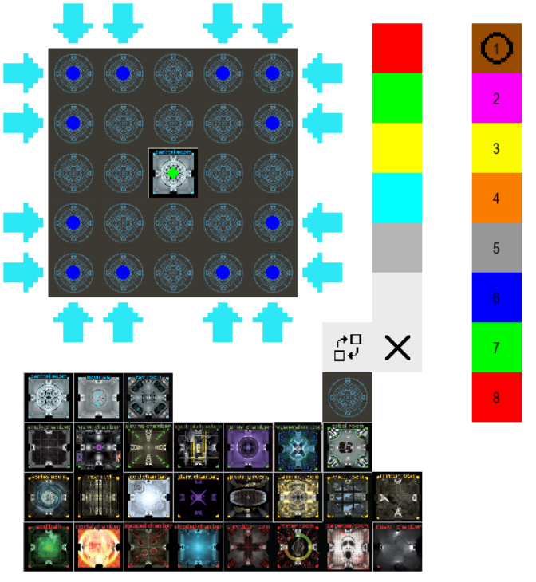

# Tutorial

## Player Selection

When the Programm starts, you first see the Player-Selection-Screen. You select all the players you want to keep track of by clicking on the square with the color of the player. The players are assigned the lowest missing number from 1 in ascending order. If you click on a player with a number, that player gets deselected. To confirm your selection, click on the white circle at the rightmost. This gets you to the play screen. Since Room25 has at least 4 players, all players will automatically get selected if you pick less than 4.

## Main Gamescreen

### temp