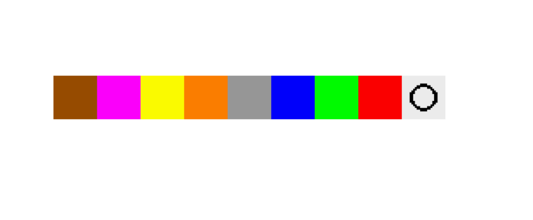

# Tutorial
## Table of Contents

- [Tutorial](#tutorial)
  - [Table of Contents](#table-of-contents)
  - [Player Selection](#player-selection)
    - [Choose Players](#choose-players)
  - [Main Gamescreen](#main-gamescreen)
    - [Rooms](#rooms)
    - [Shift Rooms](#shift-rooms)
    - [Reveal Room](#reveal-room)
    - [Make Notes](#make-notes)

## Player Selection

### Choose Players
Each empty square represents a potential player. Click on a square to select that player. This also assigns a number to that player, which represents the order. You can deselect a player by clicking on the square again. Click on the white square with the circle to confirm your selection.

Room25 needs at least 4 playable characters, which is why all potential players will be treated as selected if less than 4 players have been selected. 

## Main Gamescreen

### Rooms

Each square found in the grid represents a room. you can select a room by clicking on it. The green dot represents the currently selected room. The blue dots represents rooms that started out in the corner, and as such are more interesting to look at compared to other rooms.

### Shift Rooms

Each arrow represents a potential shift direction. Click on an arrow to shift all rooms in the same row or column as the arrow in the direction of the arrow. 

### Reveal Room

All potential rooms are found at the bottom of the Main Gamescreen. By clicking on a potential room, the picture of the selected room in the main grid will change to match the potential selected room.

The picture in the top-right corner of the potential rooms represents an unknown room. Any room with a picture different than the unkown picture counts as revealed.

### Make Notes

